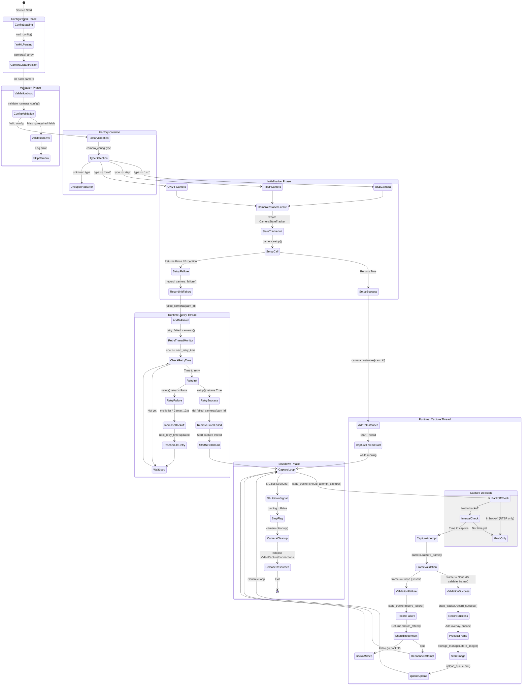

# Camera Object Lifecycle Diagram

This document describes the complete lifecycle of a camera object in SAI-Cam, from configuration to shutdown.

## Overview

```
┌─────────────────────────────────────────────────────────────────────────────────────┐
│                           CAMERA LIFECYCLE OVERVIEW                                  │
├─────────────────────────────────────────────────────────────────────────────────────┤
│  config.yaml → Factory → CameraInstance → Capture Thread → Upload Queue → Cleanup   │
│                    ↓              ↓              ↓                                   │
│               Validation    StateTracker    Backoff/Retry                            │
└─────────────────────────────────────────────────────────────────────────────────────┘
```

## Detailed State Machine



## Component Interaction Diagram

```
┌─────────────────────────────────────────────────────────────────────────────────────────┐
│                                    CameraService                                         │
│  ┌─────────────────┐  ┌─────────────────┐  ┌─────────────────┐  ┌─────────────────┐     │
│  │ camera_instances│  │ failed_cameras  │  │  upload_queue   │  │ storage_manager │     │
│  │   Dict[id,inst] │  │ Dict[id,tuple]  │  │     Queue       │  │  StorageManager │     │
│  └────────┬────────┘  └────────┬────────┘  └────────┬────────┘  └────────┬────────┘     │
│           │                    │                    │                    │               │
└───────────┼────────────────────┼────────────────────┼────────────────────┼───────────────┘
            │                    │                    │                    │
            ▼                    ▼                    ▼                    ▼
┌─────────────────────────────────────────────────────────────────────────────────────────┐
│                                  CameraInstance                                          │
│  ┌─────────────────────────────────────────────────────────────────────────────────┐    │
│  │  camera: BaseCamera    state_tracker: CameraStateTracker    running: bool       │    │
│  │  capture_interval: int  timestamp_last_image: float                              │    │
│  └─────────────────────────────────────────────────────────────────────────────────┘    │
│                                         │                                                │
│                    ┌────────────────────┴────────────────────┐                          │
│                    ▼                                         ▼                          │
│  ┌─────────────────────────────────┐     ┌─────────────────────────────────────────┐   │
│  │        BaseCamera               │     │         CameraStateTracker              │   │
│  │  ┌───────────────────────────┐  │     │  ┌───────────────────────────────────┐  │   │
│  │  │ is_connected: bool       │  │     │  │ state: HEALTHY|FAILING|OFFLINE   │  │   │
│  │  │ reconnect_attempts: int  │  │     │  │ consecutive_failures: int        │  │   │
│  │  │ max_reconnect_attempts   │  │     │  │ backoff_multiplier: 1-12         │  │   │
│  │  └───────────────────────────┘  │     │  │ next_attempt_time: float         │  │   │
│  │                                 │     │  │ rl_logger: RateLimitedLogger     │  │   │
│  │  Methods:                       │     │  └───────────────────────────────────┘  │   │
│  │  - setup() → bool              │     │                                          │   │
│  │  - capture_frame() → ndarray   │     │  Methods:                                │   │
│  │  - validate_frame() → bool     │     │  - record_success()                      │   │
│  │  - reconnect() → bool          │     │  - record_failure() → should_attempt     │   │
│  │  - cleanup()                   │     │  - should_attempt_capture() → bool       │   │
│  │  - get_camera_info() → dict    │     │  - time_until_next_attempt() → float     │   │
│  └─────────────────────────────────┘     └─────────────────────────────────────────┘   │
└─────────────────────────────────────────────────────────────────────────────────────────┘
```

## Camera State Transitions

```
                    ┌──────────────────────────────────────────────────────────┐
                    │              CameraStateTracker States                    │
                    └──────────────────────────────────────────────────────────┘

                                      ┌─────────┐
                              ┌───────│ HEALTHY │◄─────────────────────────┐
                              │       └────┬────┘                          │
                              │            │                               │
                    record_success()       │ capture_frame() failed        │
                              │            │ (1-2 failures)                │
                              │            ▼                               │
                              │       ┌─────────┐                          │
                              ├───────│ FAILING │──────────────────────────┤
                              │       └────┬────┘                          │
                              │            │                               │
                              │            │ 3+ consecutive failures       │ record_success()
                              │            ▼                               │ (from any state)
                              │       ┌─────────┐                          │
                              └───────│ OFFLINE │──────────────────────────┘
                                      └────┬────┘
                                           │
                                           │ Exponential backoff:
                                           │ 1x → 2x → 4x → 8x → 12x capture_interval
                                           ▼
                                    ┌──────────────┐
                                    │ retry every  │
                                    │ N * interval │
                                    └──────────────┘
```

## Initialization Failure Handling

```
┌─────────────────────────────────────────────────────────────────────────────────────┐
│                        INITIALIZATION RETRY MECHANISM                                │
└─────────────────────────────────────────────────────────────────────────────────────┘

  setup_cameras()                              retry_failed_cameras() Thread
       │                                              │
       ▼                                              │
  ┌─────────────┐                                     │
  │ For each    │                                     │
  │ camera in   │                                     │
  │ config      │                                     │
  └──────┬──────┘                                     │
         │                                            │
         ▼                                            ▼
  ┌─────────────────┐    Success    ┌───────────────────────────┐
  │ _try_initialize │──────────────►│ camera_instances[cam_id]  │
  │ _camera()       │               │ (Start capture thread)    │
  └────────┬────────┘               └───────────────────────────┘
           │                                  ▲
           │ Failure                          │ Success on retry
           ▼                                  │
  ┌─────────────────────┐                     │
  │ _record_camera      │                     │
  │ _failure()          │                     │
  └────────┬────────────┘                     │
           │                                  │
           ▼                                  │
  ┌─────────────────────────────────────┐     │
  │ failed_cameras[cam_id] = (          │     │
  │   config,                           │     │
  │   attempts,        ←─ incremented   │     │
  │   next_retry_time  ←─ now + backoff │     │
  │ )                                   │     │
  └────────────────┬────────────────────┘     │
                   │                          │
                   │  Backoff Schedule:       │
                   │  Attempt 1: 1x interval  │
                   │  Attempt 2: 2x interval  │
                   │  Attempt 3: 4x interval  │
                   │  Attempt 4: 8x interval  │
                   │  Attempt 5+: 12x interval│
                   │                          │
                   └──────────────────────────┘
```

## Capture Loop Flow

```
┌─────────────────────────────────────────────────────────────────────────────────────┐
│                              CAPTURE LOOP DETAIL                                     │
└─────────────────────────────────────────────────────────────────────────────────────┘

        ┌─────────────────────────────────────────────────────────────────────┐
        │                        capture_images() Thread                       │
        └─────────────────────────────────────────────────────────────────────┘
                                         │
                                         ▼
                              ┌─────────────────────┐
                              │   while running     │◄──────────────────────┐
                              └──────────┬──────────┘                       │
                                         │                                  │
                                         ▼                                  │
                      ┌──────────────────────────────────────┐              │
                      │ state_tracker.should_attempt_capture()│              │
                      └──────────────────┬───────────────────┘              │
                                         │                                  │
                        False            │          True                    │
             ┌───────────────────────────┴────────────────────┐             │
             │                                                │             │
             ▼                                                ▼             │
  ┌─────────────────────┐               ┌───────────────────────────┐       │
  │ RTSP only:          │               │ time since last capture   │       │
  │ camera.grab_frame() │               │ >= capture_interval?      │       │
  │ (keep stream alive) │               └─────────────┬─────────────┘       │
  └──────────┬──────────┘                             │                     │
             │                          False         │      True           │
             │                   ┌────────────────────┴──────────┐          │
             │                   │                               │          │
             │                   ▼                               ▼          │
             │        ┌──────────────────┐        ┌────────────────────┐    │
             │        │ sleep(polling)   │        │ camera.capture_    │    │
             │        └────────┬─────────┘        │ frame()            │    │
             │                 │                  └─────────┬──────────┘    │
             │                 │                            │               │
             └─────────────────┤                            ▼               │
                               │              ┌──────────────────────────┐  │
                               │              │ frame != None &&         │  │
                               │              │ validate_frame(frame)    │  │
                               │              └───────────┬──────────────┘  │
                               │                          │                 │
                               │            False         │      True       │
                               │         ┌────────────────┴─────────┐       │
                               │         │                          │       │
                               │         ▼                          ▼       │
                               │  ┌──────────────────┐   ┌──────────────────┐
                               │  │ state_tracker.   │   │ state_tracker.   │
                               │  │ record_failure() │   │ record_success() │
                               │  └────────┬─────────┘   └────────┬─────────┘
                               │           │                      │
                               │           ▼                      ▼
                               │  ┌──────────────────┐   ┌──────────────────┐
                               │  │ should_attempt?  │   │ - Add timestamp  │
                               │  │ → reconnect()    │   │ - Encode JPEG    │
                               │  │ Sleep backoff    │   │ - Store locally  │
                               │  └────────┬─────────┘   │ - Queue upload   │
                               │           │             └────────┬─────────┘
                               │           │                      │
                               └───────────┴──────────────────────┘
```

## Camera Type-Specific Behavior

### ONVIF Camera

```
┌─────────────────────────────────────────────────────────────────────────────────────┐
│                              ONVIF CAMERA SPECIFICS                                  │
└─────────────────────────────────────────────────────────────────────────────────────┘

  setup():
    1. Load credentials from config or environment
    2. Auto-detect WSDL path (critical for ONVIF)
    3. Create ONVIFCamera connection
    4. Get device info (manufacturer, model)
    5. Create media service
    6. Get ONVIF profile list
    7. Get snapshot URI from first profile

  capture_frame():
    1. HTTP GET to snapshot_uri
    2. HTTPDigestAuth(username, password)
    3. cv2.imdecode(response.content)

  Failure Modes:
    - 401 Unauthorized (wrong credentials)
    - Connection timeout (camera offline)
    - WSDL path not found
    - No ONVIF profiles available
```

### RTSP Camera

```
┌─────────────────────────────────────────────────────────────────────────────────────┐
│                               RTSP CAMERA SPECIFICS                                  │
└─────────────────────────────────────────────────────────────────────────────────────┘

  setup():
    1. cv2.VideoCapture(rtsp_url, cv2.CAP_FFMPEG)
    2. Set resolution, FPS, buffer size
    3. Wait for initialization (init_wait)
    4. Verify stream is opened

  capture_frame():
    1. cap.read() → (ret, frame)

  grab_frame():  ← UNIQUE TO RTSP
    1. cap.grab() - keeps stream alive without decoding
    2. Called during backoff periods

  Failure Modes:
    - RTSP URL unreachable
    - Stream format incompatible
    - H.264/H.265 codec issues
    - Network timeout
```

### USB Camera

```
┌─────────────────────────────────────────────────────────────────────────────────────┐
│                                USB CAMERA SPECIFICS                                  │
└─────────────────────────────────────────────────────────────────────────────────────┘

  setup():
    1. Determine device_id (path or index)
    2. Check if device exists
    3. cv2.VideoCapture(device_id)
    4. Set resolution, FPS, buffer size
    5. Set camera controls (exposure, brightness, contrast)
    6. Capture test frame

  capture_frame():
    1. cap.read() → (ret, frame)

  list_available_devices():  ← UNIQUE TO USB
    1. Scan /dev/video* paths
    2. Test device indices 0-4

  Failure Modes:
    - Device path doesn't exist
    - Device in use by another process
    - Permission denied
    - Hardware disconnected
```

## Corner Cases and Validations

### Configuration Validation (camera_factory.py)

| Field | Validation | Error Message |
|-------|-----------|---------------|
| `id` | Required | "Camera ID is required" |
| `type` | Must be usb/rtsp/onvif | "Unsupported camera type: X" |
| `device_path` or `device_index` | Required for USB | "USB cameras require either 'device_path' or 'device_index'" |
| `rtsp_url` | Required for RTSP | "RTSP cameras require 'rtsp_url'" |
| `address` | Required for ONVIF | "ONVIF cameras require 'address'" |
| `resolution` | [width, height] if present | "Resolution must be [width, height]" |
| `fps` | Positive number if present | "FPS must be a positive number" |
| `capture_interval` | Positive number if present | "Capture interval must be a positive number" |

### Frame Validation (base_camera.py)

| Condition | Result | Action |
|-----------|--------|--------|
| `frame is None` | Invalid | Return False |
| `frame.size == 0` | Invalid | Return False |
| `avg_value < 5` | Valid + Warning | "Low brightness frame detected" |
| `avg_value > 250` | Valid + Warning | "High brightness frame detected" |
| Normal frame | Valid | Return True |

### State Transitions

| Current State | Event | New State | Backoff |
|---------------|-------|-----------|---------|
| HEALTHY | 1st failure | FAILING | None |
| HEALTHY | 2nd failure | FAILING | None |
| FAILING | 3rd failure | OFFLINE | 1x interval |
| OFFLINE | failure | OFFLINE | 2x → 4x → 8x → 12x |
| Any | success | HEALTHY | Reset to 0 |

### Edge Cases Identified

1. **All cameras fail at startup**: Service continues running, retry thread handles recovery
2. **Camera recovers during backoff**: Next scheduled capture will succeed
3. **ONVIF WSDL path not found**: Attempts without explicit path (may fail)
4. **USB device removed**: Device path check catches this on reconnect
5. **RTSP stream hung**: grab_frame() keeps attempting, backoff prevents log spam
6. **Config reload**: Supported via SIGHUP for safe settings (logging, monitoring, server, advanced)
7. **Thread crash**: Capture coordinator detects dead threads and restarts them
8. **Max reconnect attempts reached**: Camera stays in OFFLINE state with max backoff

## Threads Overview

| Thread Name | Purpose | Loop Interval |
|-------------|---------|---------------|
| CaptureCoordinator | Monitor/restart camera threads | 10s |
| Camera-{cam_id} | Capture images for specific camera | polling_interval (0.1s) |
| UploadProcessor | Upload images from queue | 0.1s |
| HealthMonitor | System resource monitoring | health_check_interval |
| StorageManager | Cleanup old files | 1 hour |
| CameraRetry | Retry failed camera initialization | 10s |
| HealthSocket | Unix socket server for status_portal | on-demand |
| WatchdogNotifier | Systemd watchdog heartbeat | watchdog_usec/2 |

## Recent Improvements (v0.2.1+)

### SIGHUP Config Hot-Reload
Send `SIGHUP` to reload configuration without restart:
```bash
sudo kill -HUP $(pgrep -f camera_service.py)
```

**Safe to reload**: logging.level, monitoring.*, server.*, advanced.*
**Requires restart**: cameras, storage.base_path, network.*, device.*

### Rich Metadata for ML Training
Each captured image now includes enhanced metadata:
- `device`: uptime_seconds, description
- `system`: cpu_percent, memory_percent, disk_percent, cpu_temp
- `camera`: capture_interval, position, resolution
- `image`: brightness_avg, dimensions
- `environment`: capture_time_utc, timezone

### Health API via Unix Socket
Camera service exposes health data at `/run/sai-cam/health.sock`.
Status portal queries this for `/api/health` endpoints:
- `GET /api/health` - Full health state
- `GET /api/health/cameras` - Camera states from CameraStateTracker
- `GET /api/health/threads` - Thread liveness info
- `GET /api/health/system` - System metrics + health monitor stats

Test with: `socat - UNIX-CONNECT:/run/sai-cam/health.sock`
